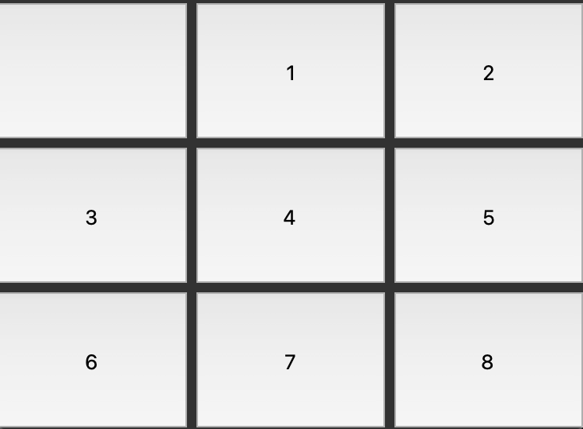

This code implements the A* algorithm to solve the 8 puzzle problem. Here's a description of the code:

1. The code begins by initializing a priority queue (`priorityq`) and a list `start_state` containing the initial state of the puzzle.
2. A goal test function (`goal_test`) is defined to check if the current state matches the goal state.
3. If no heuristic function (`huristic`) is provided, the code initializes a default heuristic called `NumberOfWrongTiles`. The heuristic is used to estimate the cost of reaching the goal state from a given state.
4. The A* algorithm starts with an iteration count (`it`) set to 1 and inserts the start state into the priority queue with its corresponding heuristic value.
5. The main loop begins, which continues until a solution is found.
6. In each iteration, the A* algorithm removes the state with the highest priority from the priority queue (`current_state`).
7. The code checks if the current state is already in the closed set (`self.closet_set`). If it is, the next state with the highest priority is removed from the priority queue until a state not in the closed set is found.
8. Information about the current iteration, such as iteration count, current heuristic value, and cost of the current state, is printed.
9. The code checks if the goal test is satisfied with the current state. If true, it prints a message indicating that the board is solved and returns the current state, which represents the solution path.
10. Next, the code generates all possible states that can be reached from the current state, along with their corresponding heuristic values.
11. For each state and its corresponding heuristic value, a deepcopy of the current state is created (`_current_state`) to avoid modifying the original state.
12. The new state is appended to `_current_state`, and the updated `_current_state` is inserted into the priority queue with a priority value calculated as the sum of the heuristic value, the length of the current state, and 1.
13. Finally, the current state is added to the closed set (`self.closet_set`) to mark it as visited and prevent revisiting it in future iterations.

Overall, this code implements the A* algorithm to search for the optimal solution path to the 8 puzzle problem by using a priority queue to prioritize states based on their heuristic values and the cost of reaching them.

## Visualization
Tkinter is here.



## Huristics
- Number of wrong tiles
    - Well huristic 
- Number of wrong tiles divides 2
    - Seems like ucs 
- Number of wrong tiles times 2
    - It's likely to be greedy

## Logs
```board created [[0, 7, 2], [3, 6, 1], [4, 8, 5]]
----- NumberOfWrongTiles -----
Iteration: 1556 -- Huristic: 0 -- Cost: 18
[+] Board is solved
board created [[0, 7, 2], [3, 6, 1], [4, 8, 5]]
----- NumberOfWrongTilesDividesTwo -----
Iteration: 5737 -- Huristic: 0 -- Cost: 18
[+] Board is solved
board created [[0, 7, 2], [3, 6, 1], [4, 8, 5]]
----- NumberOfWrongTilesTimesTwo -----
Iteration: 673 -- Huristic: 0 -- Cost: 184
[+] Board is solved
--------------------------------------
board created [[7, 3, 2], [6, 1, 4], [0, 5, 8]]
----- NumberOfWrongTiles -----
Iteration: 3818 -- Huristic: 0 -- Cost: 20
[+] Board is solved
board created [[7, 3, 2], [6, 1, 4], [0, 5, 8]]
----- NumberOfWrongTilesDividesTwo -----
Iteration: 13793 -- Huristic: 0 -- Cost: 20
[+] Board is solved
board created [[7, 3, 2], [6, 1, 4], [0, 5, 8]]
----- NumberOfWrongTilesTimesTwo -----
Iteration: 1706 -- Huristic: 0 -- Cost: 206
[+] Board is solved
--------------------------------------
board created [[1, 7, 2], [3, 0, 8], [6, 4, 5]]
----- NumberOfWrongTiles -----
Iteration: 364 -- Huristic: 0 -- Cost: 14
[+] Board is solved
board created [[1, 7, 2], [3, 0, 8], [6, 4, 5]]
----- NumberOfWrongTilesDividesTwo -----
Iteration: 1248 -- Huristic: 0 -- Cost: 14
[+] Board is solved
board created [[1, 7, 2], [3, 0, 8], [6, 4, 5]]
----- NumberOfWrongTilesTimesTwo -----
Iteration: 309 -- Huristic: 0 -- Cost: 140
[+] Board is solved...```